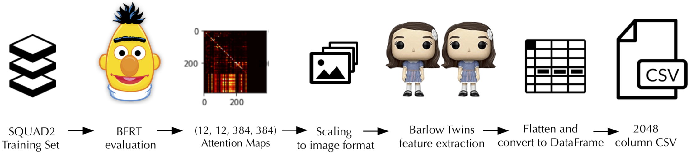

# Attention Distribution
### Across Heads and Layers of a Bert-Base Transformer fine-tuned on QA


## Overview:
A Question-Answering Model (huggingface) model was loaded with pre-trained bert-base-cased weights, and fine-tuned on the Squad2 Dataset, using a max-token size of 384.

Then, examples from the training dataset were evaluated on the fine-tuned model, producing 144 heads worth of attention matrices - 12 heads per layer, of which there are also 12.  Weights mapping each token to all tokens ( 384x384, or 147,456 parameters per attention matrix) are collected for all 131,944 squad2 training set examples downloaded from [SQuAD-explorer](https://rajpurkar.github.io/SQuAD-explorer/) [(direct file link)].

Each attention matrix is rescaled to the 0-255 range and fed to a trained Barlow Twins model ( with the last, linear classifier layer removed ) to produce a representation as a 2048 dimension vector.  This feature extraction reduces the dimensionality by nearly an order of magnitude.

Using the (https://rajpurkar.github.io/SQuAD-explorer/dataset/train-v2.0.json) the resulting dataset is over 18M data points and takes up a little more than 400GB as 26 separate CSVs ~16gb apiece.  The full dataset listing is in a public google storage bucket at https://storage.googleapis.com/representations_central/ under the folder /datasets/7-18-21/ and a subset ( the first 300 examples of each of the full CSVs ) is available as 26 CSVs at ~1gb each under the folder /datasets/partitions.

Intel Python:registered: enhanced Scikit-Learn was benchmarked as an option for getting better performance using multple CPU cores over the single-core scikit-learn implementation, but we figured we could do better than that.  With a 50-100x speedup over CPU clustering, the RAPIDs CUDA enabled cuML library and Dask for distributing across multiple GPUs were settled on for their extraordinary performance.  Some exploratory dimensionality reduction ( PCA, with disappointing but not surprising ) was performed, and then kMeans and DBSCAN clustering algorithms were run with grid searches across relevant hyperparameters.

Results were then correlated with their position in the layer/head architecture and visualized as a 12x12 2d density plot of the location of heads across all layers in each cluster.

## Findings:

When visualizing the density of points across the layer/head matrix in clusters created by kMeans, there is visible horizontal banding, a few being all at the last layer and some almost all at the first layer, with many more across part but not all of the middle layers.  This would seem to indicate that some of the structure of transformer model's architecture has been preserved through our scaling and transformation - potentially enough information remains to make more in-depth analysis of the distribution of attention weights across all heads and layers, with the benefit of a much smaller representation. [kMeans_cluster_analysis.ipynb](https://github.com/pschroedl/transformer_attention_clustering/blob/main/clustering/kMeans_cluster_analysis.ipynb)  

Clustering using DBScan largely produced two dominant clusters, one cluster favoring the earlier layers of the bert architecture, and the noise (-1 indexed) cluster primarily made up of later layers.  This could be interpreted as 'distance' between heads and their neighbors increases as the input data travels through subsequent layers.  Is the information represented by earlier heads more specific and less general and therefore more similar to eachother in weights?  It seems intuitively correct, since it reflects the architecture of the transformer model. These clusterings again suggest there may be enough variance retained after our feature extraction to warrant futher analysis.

The squad2 examples were sampled sequentially so neighboring examples share the same provided context with differing questions. The clusters outside of the main, largest cluster and noise that are identified many times contain only a single head.  At the end of the notebook [dbscan_cluster_analysis.ipynb](https://github.com/pschroedl/transformer_attention_clustering/blob/main/clustering/dbscan_cluster_analysis.ipynb), we see that some of these points indices are separated by 144, meaning they come from a consecutive sequence of examples.  In squad2, there are typically a number of questions applied to the same context.  Since examples contain both context and question in their input tokens, it makes sense that these examples would have heads working similarly, assigning nearly identical weight mappings since the input shares so many tokens.

In many cases though, where there are more than just a few heads in the cluster, some of the same heads appear in this same cluster, despite being tens of thousands of examples apart - clearly not referring to the same context.


A Springboard Capstone Project: [Proposal](proposal.md)

## Contents:

• bert_fine_tuning/

[run_squad.py](https://github.com/pschroedl/transformer_attention_clustering/blob/main/bert_fine_tuning/run_squad.py) - modified version of huggingface provided script  
[fine_tuning.ipynb](https://github.com/pschroedl/transformer_attention_clustering/blob/main/bert_fine_tuning/fine-tune.ipynb) - a wrapper around the cli call to run_squad.py  
[fine_tune.sh](https://github.com/pschroedl/transformer_attention_clustering/blob/main/bert_fine_tuning/fine-tune.sh) - script calling run_sqad for fine-tuning including cli parameters  
[eval.sh](https://github.com/pschroedl/transformer_attention_clustering/blob/main/bert_fine_tuning/eval.sh) - script calling run_squad for evaluation including cli parameters  
[eval.log](https://github.com/pschroedl/transformer_attention_clustering/blob/main/bert_fine_tuning/eval.log) - evaluation output for our model  

• exploration/

(These exploratory files are included, as well as the separate extract/transform steps in protoyping the pipeline, in order to provide some insight into the mechanisms of transformation used)

[attention_exploration.ipynb](https://github.com/pschroedl/transformer_attention_clustering/blob/main/exploration/attention_exploration.ipynb) - visualizing various huggingface Transformer outputs  
[transform_prototyping.ipynb](https://github.com/pschroedl/transformer_attention_clustering/blob/main/exploration/transform_prototyping.ipynb) - prototyping transformation to representations  
[transform_representation.ipynb](https://github.com/pschroedl/transformer_attention_clustering/blob/main/exploration/transform_representation_exploration.ipynb) - more exploration of process of data transformation  

• pipeline/


[extract_attentions.ipynb](https://github.com/pschroedl/transformer_attention_clustering/blob/main/exploration/extract_attentions.ipynb) - modified run_squad.py to output raw attention matrices  
[transform_attentions.ipynb](https://github.com/pschroedl/transformer_attention_clustering/blob/main/pipeline/transform_attentions.ipynb) - prototyping raw attentions for inital clustering exploration  
[extract_transform_attentions.ipynb](https://github.com/pschroedl/transformer_attention_clustering/blob/main/pipeline/extract_transform_attentions.ipynb) -  from bert evaluation to dataset output to csv  
[dataset_partitioning.ipynb](https://github.com/pschroedl/transformer_attention_clustering/blob/main/pipeline/dataset_partitioning.ipynb) - sub sampling a cross section of the dataset  
[remove_index.ipynb](https://github.com/pschroedl/transformer_attention_clustering/blob/main/pipeline/remove_index.ipynb) - batch repair to 400GB dataset necessary because of human error

    
• clustering/

[intel_python_clustering.ipynb](https://github.com/pschroedl/transformer_attention_clustering/blob/main/clustering/intel_python_clustering.ipynb) - benchmarking Intel Python accelerated scikit-learn  
[PCA_visualization.ipynb](https://github.com/pschroedl/transformer_attention_clustering/blob/main/clustering/PCA_visualization.ipynb) - exploring PCA with attention representations  

[optimalK.ipynb](https://github.com/pschroedl/transformer_attention_clustering/blob/main/clustering/optimalK.ipynb) - determining optimal k for kMeans  
[kMeans.ipynb](https://github.com/pschroedl/transformer_attention_clustering/blob/main/clustering/kMeans.ipynb) - clustering segmented dataset with Dask + cuML kMeans  
[kMeans_cluster_analysis.ipynb](https://github.com/pschroedl/transformer_attention_clustering/blob/main/clustering/kMeans_cluster_analysis.ipynb) - visualization of kmeans clustering results

[dbscan_grid_search.ipynb](https://github.com/pschroedl/transformer_attention_clustering/blob/main/clustering/dbscan_grid_search.ipynb) - observing cluster count vs. noise for various epsilon and min_samples for DBSCAN  
[dbscan_output.ipynb](https://github.com/pschroedl/transformer_attention_clustering/blob/main/clustering/dbscan_output.ipynb) - DBSCAN run with layer/head indexed CSVs saved for analysis  
[dbscan_cluster_analysis.ipynb](https://github.com/pschroedl/transformer_attention_clustering/blob/main/clustering/dbscan_cluster_analysis.ipynb) - visualizing clusters  

(note: in progress)
[dbscan_output-iterative.ipynb](https://github.com/pschroedl/transformer_attention_clustering/blob/main/clustering/dbscan_output-iterative.ipynb) - DBSCAN re-run and layer/head indexed CSVs saved for analysis  
[dbscan_cluster_analysis-iterative.ipynb](https://github.com/pschroedl/transformer_attention_clustering/blob/main/clustering/dbscan_cluster_analysis-iterative.ipynb) - visualizing iterative re-clustering results  
## Running the code

I used Docker and the tensorflow:latest-gpu_juptyer image for inital exploration and the extract-transform pipeline

```
sudo docker run --rm --gpus all -p 8888:8888 -v $(pwd):/tf/notebooks tensorflow/tensorflow:latest-gpu-jupyter
```


For gpu accelerated clustering and dimensionality reduction, I leveraged cuML and Dask - which can be easily utilized with the Rapids Docker image, which also hosts a jupyter server:

```bash
run --gpus all -it --rm -p 8888:8888 -p 8787:8787 -p 8786:8786 -v "$(pwd):/rapids/notebooks/host/" rapidsai/rapidsai:21.06-cuda11.0-runtime-ubuntu18.04-py3.7

```

Both images lacked some libraries, so current versions of transformers and others were pip installed in a notebook or juptyer terminal as needed.  However, torch needed to match the version of our installed nvidia cuda drivers:

```
pip3 install torch==1.9.0+cu111 torchvision==0.10.0+cu111 torchaudio==0.9.0 -f https://download.pytorch.org/whl/torch_stable.html
```
Relevant versions for other cuda installations can be found on [pytorch.org](https://pytorch.org/get-started/locally/)


## Extract attentions from fine-tuned model during evaluation

In exploration/attention_exploration I investigated working with BERT models and visualization.  Comparing and contrasting heads and layers at this level of granularity led motivated working with a larger set to be able to see if we could utilize traditional machine learning methods to make some sense of their relationship, if any could be foun. 

The relevant code from squad.py file was used in exploration/extract_attentions.ipynb to produce raw attention matrices stored as torch .pkl files.  This process would use nearly 100gb of our available 128gb of memory to produce 100 examples worth of attention matrices at a time ( 100 examples x 12 layers @ 12 heads - 14400 384x384 matrices ), each file taking up ~10GB apiece.

## Transforming attention matrices to lower dimensional representations

While clearly this wasn't going to be possible for us to produce the entire 130k+ examples dataset worth of raw attentions due to space limitation, this gave us the opportunity to exlore our options and informed the decision to use the barlow twins model for feature extraction.

Our pipeline consisted of the following steps:

• Feed squad2 example to fine-tuned BERT  
• Scale attention values to 0-255  
• Reshape to (1, 3, 384, 384) tensor  
• Extract features using modified Barlow Twins  
• Flatten 12x12 representations  
• Convert tensors to dataframe columns  
• Append to dataframe  

To stay within memory constraints ( under 100gb of RAM ), examples were batched into representation format and added to an in-memory dataframe 350 at a time.  Every 5000 examples, this dataframe was written out to file, resulting in (26) ~16gb files representing all 130k squad2 training examples.


## Evaluating clustering algorithms on transformed attentions

We knew scaling was going to be of primary concern because we wanted to be able to cover as much as possible of the squad2 dataset.  Intel makes a [patch for Scikit-learn](https://github.com/intel/scikit-learn-intelex) which allows for the use of multiple cores, and while this looked like a promising alternative, the speed-up was not as significant as I had hoped.

In [intel_python_clustering.ipynb](https://github.com/pschroedl/transformer_attention_clustering/blob/main/clustering/intel_python_clustering.ipynb) a smaller size dataset of 100 squad2 examples ( 14400 attention heads ), kMeans on 8 cores shows a roughly linear improvement from 10 minutes to 1.5 minutes.

On a larger set - the 2000 squad2 example output from pipeline/transform_attentions.ipynb - speedup was similar (~7x) and took over 45x longer to cluster with only 2x the # of rows.

[cuML](https://github.com/rapidsai/cuml) promised and delivered _much_ faster results - With one drawback - our total sample size was limited by the amount of GPU VRAM available.  Combining Dask and cuML allows us to parallelize kMeans and DBSCAN across multiple GPUs on the same machine.  This increased our capacity to 48gb across two Nvidia RTX-3090s.

In order to get a representational cross-section of the squad2 examples and more easily fine tune the size of our dataset to fit into VRAM, in [dataset_partitioning.ipynb](https://github.com/pschroedl/transformer_attention_clustering/blob/main/exploration/dataset_partitioning.ipynb) 300 examples were extracted from each of the 26 files making up our whole dataset.

Based on findings in [optimalK.ipynb](https://github.com/pschroedl/transformer_attention_clustering/blob/main/clustering/optimalK.ipynb) we performed kMeans clustering on our dataset in [kMeans.ipynb](https://github.com/pschroedl/transformer_attention_clustering/blob/main/clustering/kMeans.ipynb)

Layers and heads columns are added for each row of the resulting cluster labels so that we can investigate correlations between clusters, heads and layers and the output is visualized in [kMeans_cluster_analysis.ipynb](https://github.com/pschroedl/transformer_attention_clustering/blob/main/clustering/kMeans_cluster_analysis.ipynb)  

Running a grid search to find optimal parameters for DBscan in [dbscan_grid_search.ipynb](https://github.com/pschroedl/transformer_attention_clustering/blob/main/clustering/dbscan_grid_search.ipynb), we proceeded to cluster in [dbscan_output.ipynb](https://github.com/pschroedl/transformer_attention_clustering/blob/main/clustering/dbscan_output.ipynb), also adding layer/head columns to the result in cluster label dataframe for analysis and visualization in [dbscan_cluster_analysis.ipynb](https://github.com/pschroedl/transformer_attention_clustering/blob/main/clustering/dbscan_cluster_analysis.ipynb).

Lastly , we've taken the samples from largest non-noise cluster (0) from dbscan runs with epsilon 0.6 and 0.7, and re-ran a grid search, again outputting a dataframe augmented with layer and head columns, unfortunately with the wrong values for those columns.  The layer and head from the cluster 0 subset needs to be added to the result labels, instead of synthesized again.   For that reason [dbscan_output-iterative.ipynb](https://github.com/pschroedl/transformer_attention_clustering/blob/main/clustering/dbscan_output-iterative.ipynb) needs to be updated as well as 
[dbscan_cluster_analysis-iterative.ipynb](https://github.com/pschroedl/transformer_attention_clustering/blob/main/clustering/dbscan_cluster_analysis-iterative.ipynb) will be re-run with the correct layer
